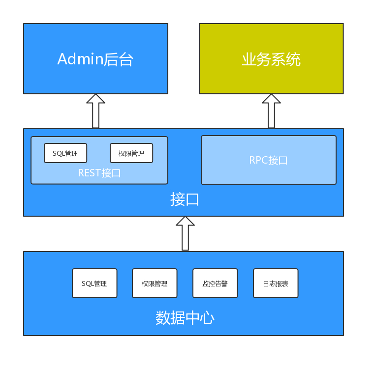

[English Document](https://github.com/netyjq/data-center/blob/master/README_EN.MD)

## 项目简介

公司有个数据采集的共享库，对应着一个数据中心的项目，每次业务方有数据查询的需求，都需要投入开发同学做SQL查询，提供接口和数据，调试和发布项目，一顿操作下来，耗时费力，伸缩性极差。

data-center是一个能实现任意sql(动态/静态)执行、统一管理、异常监控的数据查询中台项目。
它真正做到了无需数据中心项目投入人力参与到业务方需求，业务方同学只需在后台录入SQL拿到sqlId，就可以使用dubbo进行调用。

项目核心功能：

1. SQL管理 
2. 统一RPC接口
3. 监控告警
4. 权限管理
5. 报表统计


## 方案

### 设计图



### 技术方案

#### Dubbo(RPC) + Freemarker(解析SQL) + Mybatis(执行SQL)

假设下面的sql需要根据parentId和name动态查询，其中parent_id和name有值传递过来就参与查询，否则不查询
```sql
SELECT * from unit_info where and parent_id = #{parentId} and name = #{name};
```
那么需要在数据中心配置下面的sql模板：
```sql
SELECT * from unit_info where 1=1 <#if parentId??>and parent_id = #{parentId}</#if> <#if name?? && name != ''>and name = #{name}</#if>
```

接下来业务方通过Dubbo调用了数据中心的RPC接口，并传递了参数parentId=1，最终sql被解析并被mybatis执行。

```sql
SELECT * from unit_info where 1=1 and parent_id = 1
```

#### 表结构设计
- user_info 用户信息表
- user_group 用户组
- user_group_mapping 用户、组关联表
- app_info 应用表
- app_user_mapping 应用和用户关联表
- sql_template sql模板表
- sql_operation_record sql操作记录表 
- api_call_record api调用记录表 **分多表**
- alarm_history 告警记录表 **分多表**
- alarm_config 告警配置表


#### 项目模块

1. data-center-admin 管理员后台 部署形式：war
2. data-center-service 提供业务接口  部署形式war
3. data-center-client 封装接口给业务方 部署形式jar
4. script sql脚本


### 业务流程

1. 业务方申请应用，得到appId
2. 配置sql，包含**sqltext**、**是否分页**、**表字段映射**，系统自带校验和测试功能。
3. 业务方集成数据中心client jar，配置duboo接口，调用api并传递对应参数
4. 数据中心响应请求，异步记录此次调用信息。


### SQL管理

供业务方进行sql模板的配置(如果动态条件则需要使用freemarker编写sql模板) 、sql的模拟测试、上下架管理等功能。

### 监控告警

支持2种形式的告警：**ERROR_COUNT**以及**SLOW_COUNT**。系统通过定时扫描，对符合条件的查询以邮件的形式发送到用户或组。

### 报表统计

数据中心会记录每次的调用请求，为日后报表统计类业务做铺垫。同时Admin后台也将以图形的方式展现部分维度下的Top调用量情况。

### 权限管理

1. 用户组与用户间的关系 —— 用于告警发送邮件以及SQL管理权限的判定
2. 用户组与应用的关系 —— 用于告警发送邮件
2. 应用与sql间的关系 —— 用于应用方调用权限的判定

## 预览


## 风险点

1. 负载风险：宕机引发整体服务不可用
2. 流控风险：某个业务查询时间过长过高影响其它业务正常运行
3. 安全风险：大表查询未limit、未走索引、全表扫描；未按需查询、大字段未过滤；锁表；SQL注入：Update、Delete、Truncate等
4. 其它待补充
