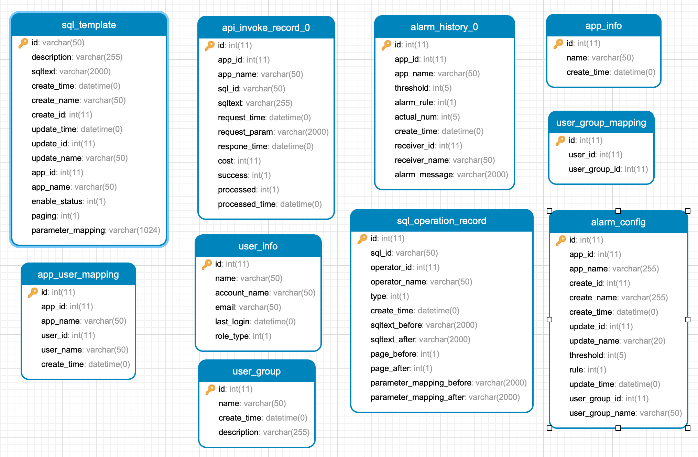
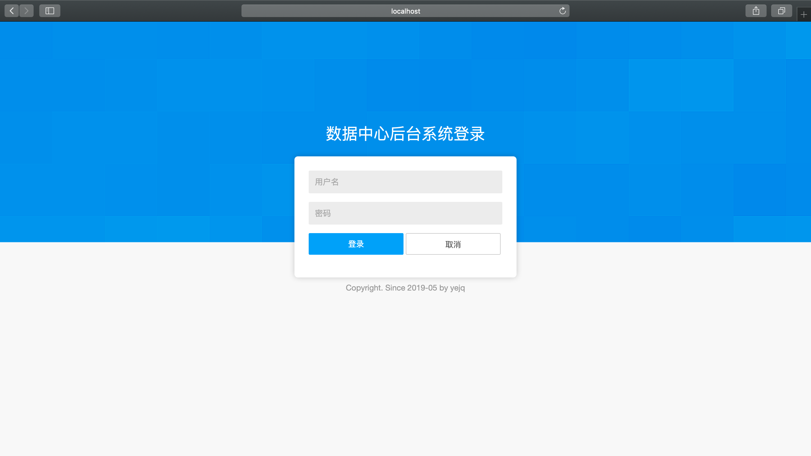
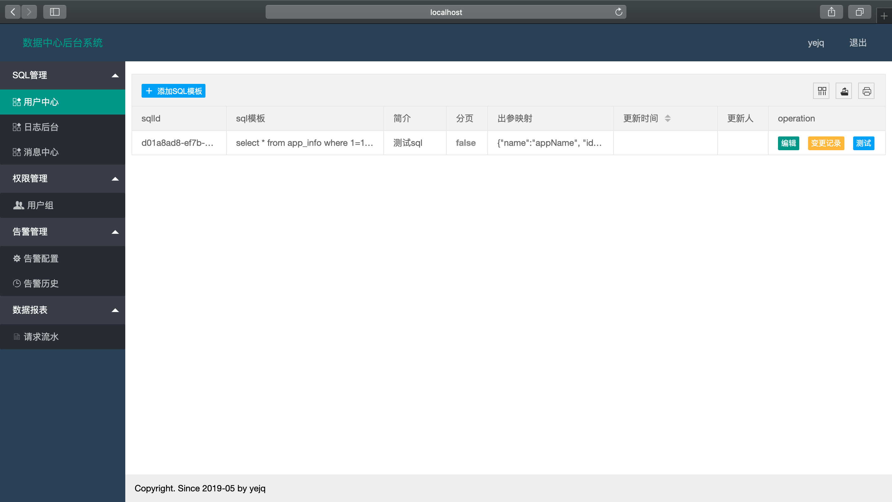

[中文文档](https://github.com/netyjq/data-center/blob/master/README.md)


## PROJECT PROFILE

An implementation of arbitrary SQL (dynamic/static) execution, unified management, exception monitoring data query project.

## BACKGROUND

The company has a database for log data collection. Every time the business party has the demand for data query, it needs the data-center project to cooperate with SQL query and provide RPC interface to return DTO data structure. Low scalability and high labor cost.


## GOAL


To achieve a set of modern data center query platform, the business side to maintain their own SQL, without data center coupling business requirements. The data center provides RPC interface capability to uniformly query data, and the business side queries the data as if it were calling a local method.


## CORE REQUIREMENTS

1. The SQL management

2. Monitor alarm

3. Authority management

4. Report statistics

5. ...


## SOLUTION

### DESIGN


### TECHNICAL SOLUTION


#### Dubbo(RPC) + Freemarker(parse SQL) + Mybatis(execute SQL)


Suppose that the following SQL requires dynamic queries based on parentId and name, where parent_id and name have values passed to participate in the query, otherwise no query is performed

```SQL
SELECT * from unit_info where and parent_id = #{parentId} and name = #{name};
```

Then you need to configure the following SQL template in the data center:

```SQL
SELECT * from unit_info where 1=1 <#if parentId?? Parent_id = #{parentId} <#if name?? && name! = '>and name = #{name}
```

Next, the business side called the RPC interface of the data center through Dubbo, and passed the parameter parentId=1. Finally, the SQL was parsed and executed by mybatis.

```SQL
SELECT * from unit_info where 1=1 and parent_id =1
```


#### TABLE STRUCTURE DESIGN

- user_info: user information table

- user_group: user group

- user_group_mapping: user&group association table

- app_info: application table

- app_user_mapping: application and user association table

- sql_template: SQL template table

- sql_operation_record: SQL operation record table

- api_call_record: API call record table ** sub-table **

- alarm_history: alarm record ** multi - list **

- alarm_config: alarm configuration table





Project module


1. Data-center-admin background deployment form: war

2. Data-center-service provides the business interface deployment form war

3. Data-center-client encapsulates the interface to deploy the form jar to the business party

4. Script SQL script


### BUSINESS PROCESSES

1. The business party applies for the application and gets the appId

2. Configure SQL, including **sqltext**, ** whether ** paging **, ** table field mapping **, the system has built-in check and test function.

3. The business side integrates the data center client jar, configures the duboo interface, calls the API and passes the corresponding parameters

4. The data center responds to the request and records the call information asynchronously.


### SQL MANAGEMENT


For the business side to configure the SQL template (if dynamic conditions need to use freemarker to write the SQL template), SQL simulation test, shelf management and other functions.


Monitoring alarm


Two forms of warning are supported: **ERROR_COUNT** and **SLOW_COUNT**. The system sends qualified queries to users or groups by regular scanning.


Report statistics


The data center records each call request to pave the way for future report statistics business. At the same time, the Admin background will also graphically display the Top calling amount of some dimensions.


### PERMISSION MANAGEMENT

1. The relationship between user groups and users -- used for the determination of alarm sending emails and SQL management rights

2. Relationship between the user group and the application -- used for alarm sending

2. Relationship between application and SQL -- used to determine the application's calling permission


## PREVIEW







## RISK POINTS

1. Load risk: the outage causes the whole service to be unavailable

2. Flow control risk: too long query time of one business will affect the normal operation of other businesses

3. Security risks: large table query without limit, index, full table scan; Not queried as required, large fields not filtered; Lock table; SQL injection: Update, Delete, Truncate, etc

4. Others to be added